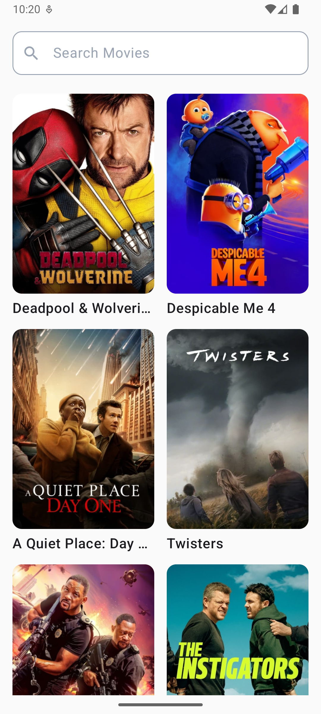
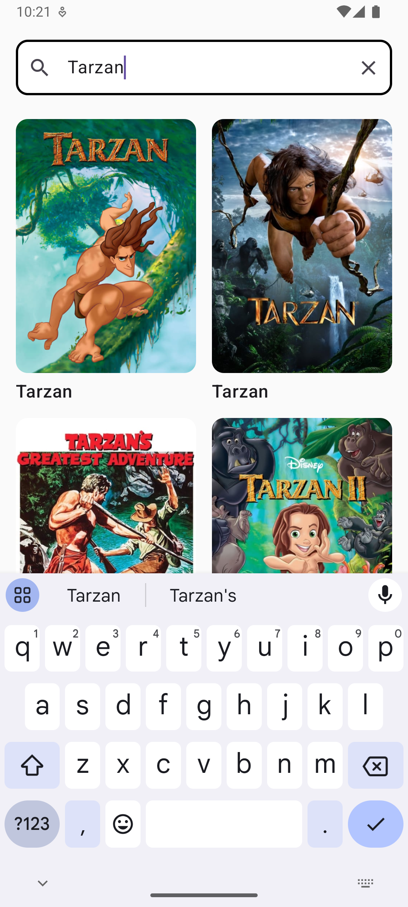

# Atlys Take Home Task

### Screenshots:

|             Trending             |            Search            |
|:--------------------------------:|:----------------------------:|
|  |  |

### Build Instructions:
1. Clone the repository.
2. Add your TMDB Api Key as `tmdbApiKey` to the `local.properties` file in the root directory of the project.
3. Build and Run the project.

### Tech Stack
 - Jetpack Compose
 - Compose Navigation
 - Kotlinx (Coroutines & Serialization)
 - Retrofit (Networking)
 - Coil (Image Loading)
 - Hilt (DI)

### Leniency Allowed in Task
- You are free to use third-party libraries for making network calls and displaying images.
- You are not required to implement on-device caching for offline support.
- You are not required to implement list pagination, just show 20 items in the list.
- You are not required to set up a multi-module architecture.
- You are not required to write unit tests.